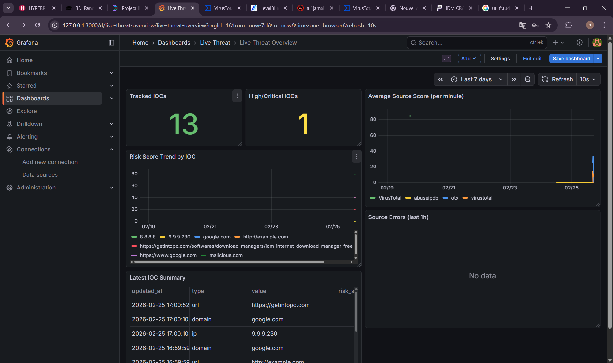
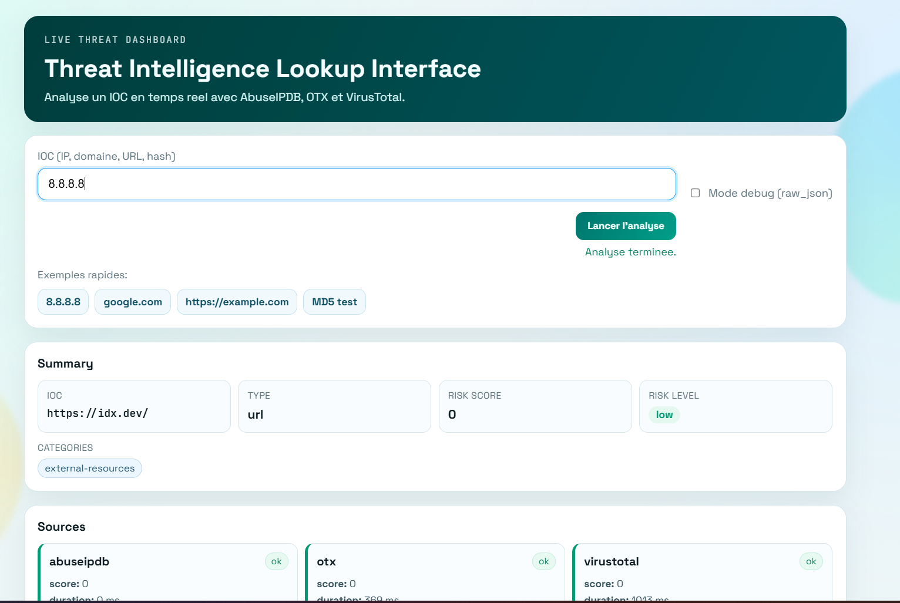
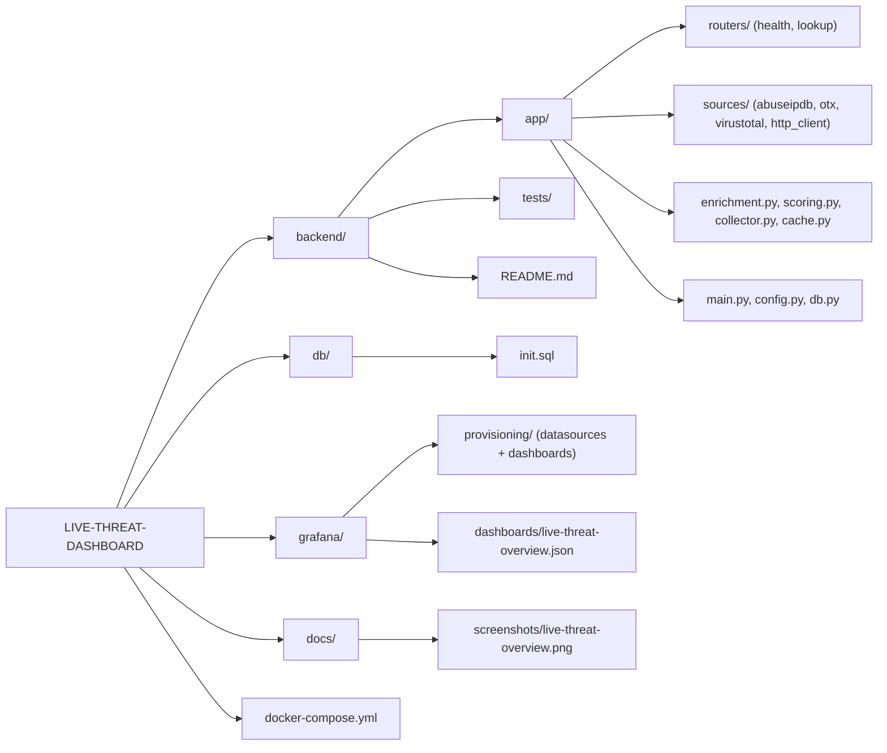
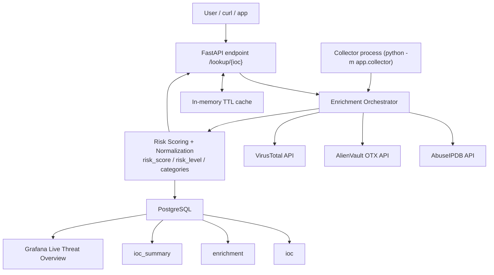

# LIVE-THREAT-DASHBOARD

Live cybersecurity threat dashboard project built with Python, FastAPI, PostgreSQL, and Grafana.

The backend aggregates threat intelligence from:
- AbuseIPDB
- AlienVault OTX
- VirusTotal

It normalizes source outputs, computes a global risk score, and stores live enrichment data for dashboard visualization.

## Problem This Tool Solves

Security teams often lose time querying multiple threat intelligence feeds manually for each IOC.
This creates slow investigations, inconsistent triage decisions, and poor visibility for managers.

This project solves that by:
- aggregating multiple feeds in one API,
- normalizing results into a single schema,
- scoring IOC risk automatically,
- and exposing live metrics in Grafana for fast decision-making.

## How It Works

1. An IOC is submitted (`/lookup/{ioc}` or inserted in DB for collector processing).
2. The enrichment orchestrator calls AbuseIPDB, OTX, and VirusTotal concurrently.
3. Source responses are normalized (`status`, `data`, `error`, `duration_ms`).
4. A unified risk score and level are computed (`low|medium|high|critical`).
5. Results are cached in memory (TTL) for API responsiveness.
6. The live collector writes historical enrichments to PostgreSQL.
7. Grafana reads `ioc_summary` and `enrichment` for real-time dashboards.

## Technologies Used

- Python 3.11
- FastAPI + Uvicorn
- Requests + AnyIO (timeouts, retries, non-blocking thread execution)
- PostgreSQL (IOC storage, enrichment history, summary table)
- Grafana (live dashboard and panels)
- Docker Compose (API + DB + Grafana orchestration)
- Pytest / unittest (smoke tests)

## Business Value

- Faster SOC triage: analysts get a single risk view instead of 3 separate portals.
- Better prioritization: `risk_score` and `risk_level` make alert queues actionable.
- Operational visibility: managers can monitor IOC trends and source error rates live.
- Lower investigation cost: caching + collector reduce repetitive manual checks.
- Auditable process: historical enrichment data supports incident reporting and review.

## Dashboard Screenshot



## Web Interface

After starting the stack, open:
- `http://127.0.0.1:8000/`

UI features:
- IOC input (IP/domain/URL/hash)
- debug toggle (`raw_json`)
- summary cards (`risk_score`, `risk_level`, categories)
- per-source cards (status, score, duration, errors)
- full JSON result viewer

## User Interface Screenshot

Add a screenshot of the FastAPI UI here:
- expected file path: `docs/screenshots/ui-interface.png`



## Tester le projet sur un PC (Windows + PowerShell)

Chemin du repo:
- `C:\Users\jamai\OneDrive\Desktop\live-threat-dashboard\live-threat-dashboard`

### 1) Lancer la stack

Terminal 1 (PowerShell), dans le chemin du repo:

```powershell
docker compose up -d --build
docker compose ps
```

### 2) Initialiser la base (une seule fois)

Terminal 1, meme chemin:

```powershell
Get-Content .\db\init.sql | docker exec -i threat_db psql -U threat -d threatdb
```

### 3) Lancer le collector live

Terminal 1, meme chemin (laisser ouvert):

```powershell
docker exec -it threat_api python -m app.collector
```

### 4) Ouvrir les 2 interfaces

- Interface utilisateur (analyse IOC manuelle): `http://127.0.0.1:8000/`
- Interface Grafana (vue live globale): `http://127.0.0.1:3000/`

Difference entre les deux:
- UI FastAPI: investigation IOC par IOC (requete ponctuelle, details source par source).
- Grafana: supervision temps reel globale (tendances, scores, erreurs, priorisation).

### 5) Verifier le flux UI -> Grafana

1. Dans l'UI (`http://127.0.0.1:8000/`), saisis une URL (ex: `https://www.google.com`) puis lance l'analyse.
2. L'IOC est auto-insere dans PostgreSQL via `/lookup/{ioc}`.
3. Le collector enrichit cet IOC et met a jour `ioc_summary` / `enrichment`.
4. Dans Grafana, apres refresh (5-10s), l'IOC apparait dans les panels/tableaux.

Verification SQL optionnelle (Terminal 2, meme chemin):

```powershell
@'
SELECT id, type, value, created_at
FROM ioc
WHERE value = 'https://www.google.com'
ORDER BY id DESC
LIMIT 5;
'@ | docker exec -i threat_db psql -U threat -d threatdb
```

## Demo Video

- Add your demo video link here (recommended for recruiters):
  - `https://www.youtube.com/watch?v=YOUR_DEMO_ID`
  - or repository asset link (GitHub release/video file)

## Organisation



## Architecture Design



## Quick start (Docker + PowerShell)

Run all commands from the repository root:

1. Create local env file (do not commit secrets):

```powershell
Copy-Item .env.example .env
```

2. Edit `.env` and set your API keys:
- `ABUSEIPDB_API_KEY`
- `OTX_API_KEY`
- `VIRUSTOTAL_API_KEY`

3. Start the stack:

```powershell
docker compose up -d --build
docker ps
```

4. Initialize database schema:

```powershell
Get-Content .\db\init.sql | docker exec -i threat_db psql -U threat -d threatdb
```

5. Insert sample IOCs:

```powershell
@'
INSERT INTO ioc(type, value)
VALUES
  ('ip','8.8.8.8'),
  ('domain','google.com'),
  ('url','http://example.com');
'@ | docker exec -i threat_db psql -U threat -d threatdb
```

6. Check API:

```powershell
curl.exe -s "http://127.0.0.1:8000/health"
curl.exe -s "http://127.0.0.1:8000/lookup/8.8.8.8"
curl.exe -s "http://127.0.0.1:8000/lookup/8.8.8.8?debug=true"
```

7. Run live collector:

```powershell
docker exec -it threat_api python -m app.collector
```

8. Verify DB is filling:

```powershell
@'
SELECT s.updated_at, i.type, i.value, s.risk_score, s.risk_level
FROM ioc_summary s
JOIN ioc i ON i.id = s.ioc_id
ORDER BY s.updated_at DESC
LIMIT 20;
'@ | docker exec -i threat_db psql -U threat -d threatdb
```

Grafana is available at:
- `http://127.0.0.1:3000` (`admin` / `admin` by default)

Grafana provisioning is automatic:
- datasource: `ThreatDB` (PostgreSQL)
- dashboard folder: `Live Threat`
- dashboard: `Live Threat Overview`

## API summary

- `GET /health`
- `GET /lookup/{ioc}`
- `GET /lookup/{ioc}?debug=true`

Response includes:
- `ioc`, `ioc_type`
- `risk_score` (0-100)
- `risk_level` (`low|medium|high|critical`)
- `categories`
- `sources[]` (normalized per source status/data/error)

## Key project behavior

- Source calls are executed concurrently.
- Each source always returns a stable structure (`ok` or `error`).
- Missing API key or upstream failure does not crash `/lookup`.
- In-memory TTL cache reduces repeated API calls.
- IOC auto-registration: each `/lookup/{ioc}` call inserts IOC into PostgreSQL (`ioc`) automatically.
- Collector writes per-source history to `enrichment` and global summary to `ioc_summary`.

## Tests

Run from `backend/`:

```powershell
python -m unittest discover -s tests -p "test_*.py" -v
python -m pytest -q
```

## More detailed backend docs

See `backend/README.md` for complete operational steps and Grafana SQL panel examples.

## Tester Une URL X (PowerShell)

Use this flow when the collector is stopped and you want to test any URL of your choice.

### Terminal 1 - Start Collector

Path:
`C:\Users\jamai\OneDrive\Desktop\live-threat-dashboard\live-threat-dashboard`

```powershell
docker compose ps
docker exec -it threat_api python -m app.collector
```

Keep Terminal 1 open.

### Terminal 2 - Test URL X via API + DB

Path:
`C:\Users\jamai\OneDrive\Desktop\live-threat-dashboard\live-threat-dashboard`

1. Define your URL:

```powershell
$URL_X = "https://example.com/path?a=1&b=2"
```

2. Encode URL for `/lookup/{ioc}` path:

```powershell
$URL_X_ENCODED = python -c "import urllib.parse,sys; print(urllib.parse.quote(sys.argv[1], safe=''))" "$URL_X"
```

3. Test immediately via API (`debug=true`):

```powershell
curl.exe -s "http://127.0.0.1:8000/lookup/$URL_X_ENCODED?debug=true"
```

4. Verify URL was auto-inserted in table `ioc`:

```powershell
@"
SELECT id, type, value, created_at
FROM ioc
WHERE value = '$URL_X'
ORDER BY id DESC
LIMIT 5;
"@ | docker exec -i threat_db psql -U threat -d threatdb
```

5. Wait 10-20 seconds, then check summary:

```powershell
@"
SELECT s.updated_at, i.value, s.risk_score, s.risk_level, s.categories
FROM ioc_summary s
JOIN ioc i ON i.id = s.ioc_id
WHERE i.value = '$URL_X'
ORDER BY s.updated_at DESC
LIMIT 5;
"@ | docker exec -i threat_db psql -U threat -d threatdb
```

6. Check per-source status for this URL:

```powershell
@"
SELECT e.fetched_at, e.source, e.raw_json->>'status' AS status, e.raw_json->>'error' AS error
FROM enrichment e
JOIN ioc i ON i.id = e.ioc_id
WHERE i.value = '$URL_X'
ORDER BY e.fetched_at DESC
LIMIT 15;
"@ | docker exec -i threat_db psql -U threat -d threatdb
```

### Terminal 3 - Optional: API only check

Path:
`C:\Users\jamai\OneDrive\Desktop\live-threat-dashboard\live-threat-dashboard`

```powershell
curl.exe -s "http://127.0.0.1:8000/health"
```

Then open Grafana:
`http://127.0.0.1:3000` and refresh dashboard `Live Threat Overview`.

