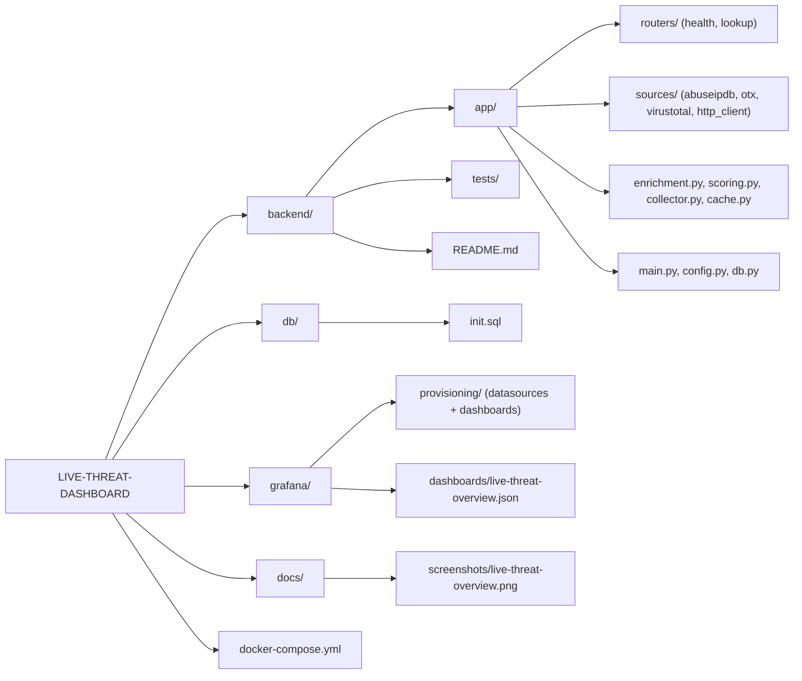
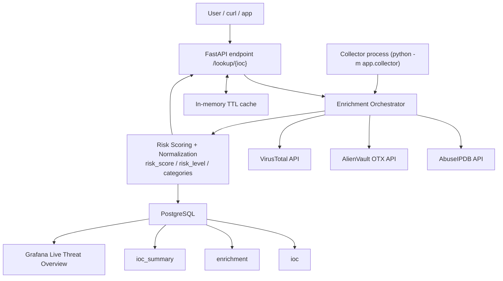

# LIVE-THREAT-DASHBOARD

Live cybersecurity threat dashboard project built with Python, FastAPI, PostgreSQL, and Grafana.

The backend aggregates threat intelligence from:
- AbuseIPDB
- AlienVault OTX
- VirusTotal

It normalizes source outputs, computes a global risk score, and stores live enrichment data for dashboard visualization.

## Problem This Tool Solves

Security teams often lose time querying multiple threat intelligence feeds manually for each IOC.
This creates slow investigations, inconsistent triage decisions, and poor visibility for managers.

This project solves that by:
- aggregating multiple feeds in one API,
- normalizing results into a single schema,
- scoring IOC risk automatically,
- and exposing live metrics in Grafana for fast decision-making.

## How It Works

1. An IOC is submitted (`/lookup/{ioc}` or inserted in DB for collector processing).
2. The enrichment orchestrator calls AbuseIPDB, OTX, and VirusTotal concurrently.
3. Source responses are normalized (`status`, `data`, `error`, `duration_ms`).
4. A unified risk score and level are computed (`low|medium|high|critical`).
5. Results are cached in memory (TTL) for API responsiveness.
6. The live collector writes historical enrichments to PostgreSQL.
7. Grafana reads `ioc_summary` and `enrichment` for real-time dashboards.

## Technologies Used

- Python 3.11
- FastAPI + Uvicorn
- Requests + AnyIO (timeouts, retries, non-blocking thread execution)
- PostgreSQL (IOC storage, enrichment history, summary table)
- Grafana (live dashboard and panels)
- Docker Compose (API + DB + Grafana orchestration)
- Pytest / unittest (smoke tests)

## Business Value

- Faster SOC triage: analysts get a single risk view instead of 3 separate portals.
- Better prioritization: `risk_score` and `risk_level` make alert queues actionable.
- Operational visibility: managers can monitor IOC trends and source error rates live.
- Lower investigation cost: caching + collector reduce repetitive manual checks.
- Auditable process: historical enrichment data supports incident reporting and review.

## Dashboard Screenshot


## Web Interface

After starting the stack, open:
- `http://127.0.0.1:8000/`

UI features:
- IOC input (IP/domain/URL/hash)
- debug toggle (`raw_json`)
- summary cards (`risk_score`, `risk_level`, categories)
- per-source cards (status, score, duration, errors)
- full JSON result viewer

## User Interface Screenshot

Add a screenshot of the FastAPI UI here:
- expected file path: `docs/screenshots/ui-interface.png`


## Test The Project On A PC (Windows + PowerShell)

Repository path:
- `C:\Users\jamai\OneDrive\Desktop\live-threat-dashboard\live-threat-dashboard`

### 1) Start the stack

Terminal 1 (PowerShell), from the repository path:

```powershell
docker compose up -d --build
docker compose ps
```

### 2) Initialize the database (one time)

Terminal 1, same path:

```powershell
Get-Content .\db\init.sql | docker exec -i threat_db psql -U threat -d threatdb
```

### 3) Start the live collector

Terminal 1, same path (keep it open):

```powershell
docker exec -it threat_api python -m app.collector
```

### 4) Open both interfaces

- User Interface (manual IOC analysis): `http://127.0.0.1:8000/`
- Grafana Interface (live global monitoring): `http://127.0.0.1:3000/`

Difference between both:
- FastAPI UI: IOC-by-IOC investigation (on-demand query, source-by-source details).
- Grafana: real-time operational supervision (trends, scores, errors, prioritization).

### 5) Verify the UI -> Grafana flow

1. In the UI (`http://127.0.0.1:8000/`), enter a URL (example: `https://www.google.com`) and run analysis.
2. The IOC is auto-inserted into PostgreSQL through `/lookup/{ioc}`.
3. The collector enriches this IOC and updates `ioc_summary` / `enrichment`.
4. In Grafana, after refresh (5-10s), the IOC appears in panels/tables.

Optional SQL verification (Terminal 2, same path):

```powershell
@'
SELECT id, type, value, created_at
FROM ioc
WHERE value = 'https://www.google.com'
ORDER BY id DESC
LIMIT 5;
'@ | docker exec -i threat_db psql -U threat -d threatdb
```

## Demo Video

- Add your demo video link here (recommended for recruiters):
  - `https://www.youtube.com/watch?v=YOUR_DEMO_ID`
  - or repository asset link (GitHub release/video file)

## Project Organization



## Architecture Design



## Run And Test (Quick)

From repository root:

1. `Copy-Item .env.example .env` and set API keys in `.env`.
2. `docker compose up -d --build`
3. `Get-Content .\db\init.sql | docker exec -i threat_db psql -U threat -d threatdb`
4. `docker exec -it threat_api python -m app.collector`
5. Open:
   - UI: `http://127.0.0.1:8000/`
   - Grafana: `http://127.0.0.1:3000/`

When you submit an IOC/URL in the UI, it is auto-inserted into PostgreSQL and then appears in Grafana after collector refresh.

For full operational commands, SQL checks, and troubleshooting, see:
- `backend/README.md`

