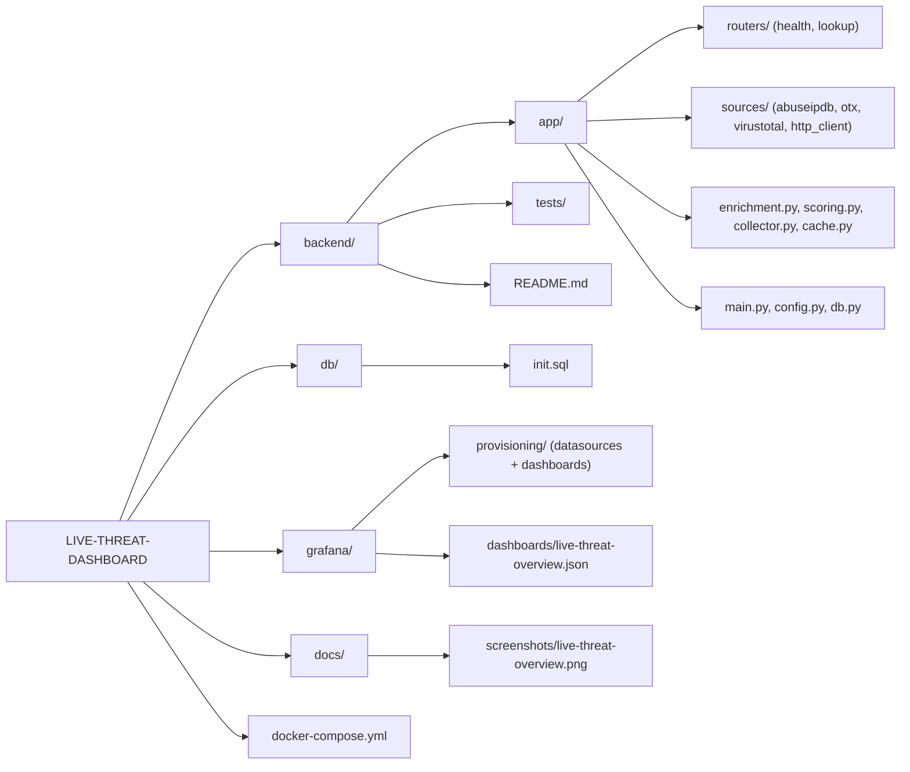
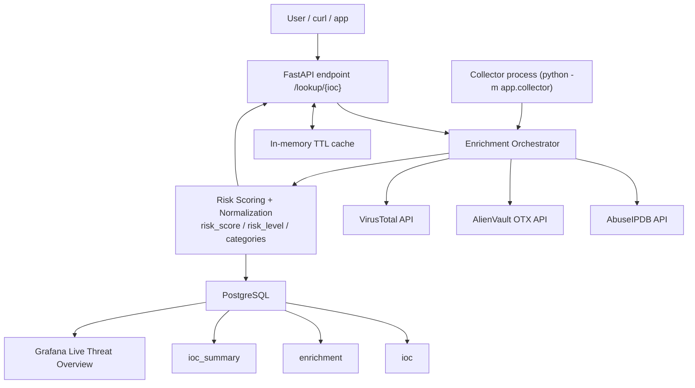

# LIVE-THREAT-DASHBOARD

Live cybersecurity threat dashboard project built with Python, FastAPI, PostgreSQL, and Grafana.

The backend aggregates threat intelligence from:
- AbuseIPDB
- AlienVault OTX
- VirusTotal

It normalizes source outputs, computes a global risk score, and stores live enrichment data for dashboard visualization.

## What this project demonstrates

- Threat intelligence aggregation from multiple APIs
- API integration and IOC enrichment (IP, domain, URL, hash)
- Resilient data pipeline (timeouts, retries, per-source errors)
- Actionable scoring (`risk_score`, `risk_level`, `categories`)
- Live data flow to PostgreSQL + Grafana visualization

## Stack

- Backend: FastAPI
- Data processing: Python
- Database: PostgreSQL
- Dashboard: Grafana
- Runtime: Docker Compose

## Dashboard Screenshot

> Save your Grafana screenshot as `docs/screenshots/live-threat-overview.png`.


## Organisation



## Architecture Design



## Quick start (Docker + PowerShell)

Run all commands from the repository root:

1. Create local env file (do not commit secrets):

```powershell
Copy-Item .env.example .env
```

2. Edit `.env` and set your API keys:
- `ABUSEIPDB_API_KEY`
- `OTX_API_KEY`
- `VIRUSTOTAL_API_KEY`

3. Start the stack:

```powershell
docker compose up -d --build
docker ps
```

4. Initialize database schema:

```powershell
Get-Content .\db\init.sql | docker exec -i threat_db psql -U threat -d threatdb
```

5. Insert sample IOCs:

```powershell
@'
INSERT INTO ioc(type, value)
VALUES
  ('ip','8.8.8.8'),
  ('domain','google.com'),
  ('url','http://example.com');
'@ | docker exec -i threat_db psql -U threat -d threatdb
```

6. Check API:

```powershell
curl.exe -s "http://127.0.0.1:8000/health"
curl.exe -s "http://127.0.0.1:8000/lookup/8.8.8.8"
curl.exe -s "http://127.0.0.1:8000/lookup/8.8.8.8?debug=true"
```

7. Run live collector:

```powershell
docker exec -it threat_api python -m app.collector
```

8. Verify DB is filling:

```powershell
@'
SELECT s.updated_at, i.type, i.value, s.risk_score, s.risk_level
FROM ioc_summary s
JOIN ioc i ON i.id = s.ioc_id
ORDER BY s.updated_at DESC
LIMIT 20;
'@ | docker exec -i threat_db psql -U threat -d threatdb
```

Grafana is available at:
- `http://127.0.0.1:3000` (`admin` / `admin` by default)

Grafana provisioning is automatic:
- datasource: `ThreatDB` (PostgreSQL)
- dashboard folder: `Live Threat`
- dashboard: `Live Threat Overview`

## API summary

- `GET /health`
- `GET /lookup/{ioc}`
- `GET /lookup/{ioc}?debug=true`

Response includes:
- `ioc`, `ioc_type`
- `risk_score` (0-100)
- `risk_level` (`low|medium|high|critical`)
- `categories`
- `sources[]` (normalized per source status/data/error)

## Key project behavior

- Source calls are executed concurrently.
- Each source always returns a stable structure (`ok` or `error`).
- Missing API key or upstream failure does not crash `/lookup`.
- In-memory TTL cache reduces repeated API calls.
- Collector writes per-source history to `enrichment` and global summary to `ioc_summary`.

## Tests

Run from `backend/`:

```powershell
python -m unittest discover -s tests -p "test_*.py" -v
python -m pytest -q
```

## More detailed backend docs

See `backend/README.md` for complete operational steps and Grafana SQL panel examples.

## Tester Une URL X (PowerShell)

Use this flow when the collector is stopped and you want to test any URL of your choice.

### Terminal 1 - Start Collector

Path:
`C:\Users\jamai\OneDrive\Desktop\live-threat-dashboard\live-threat-dashboard`

```powershell
docker compose ps
docker exec -it threat_api python -m app.collector
```

Keep Terminal 1 open.

### Terminal 2 - Test URL X via API + DB

Path:
`C:\Users\jamai\OneDrive\Desktop\live-threat-dashboard\live-threat-dashboard`

1. Define your URL:

```powershell
$URL_X = "https://example.com/path?a=1&b=2"
```

2. Encode URL for `/lookup/{ioc}` path:

```powershell
$URL_X_ENCODED = python -c "import urllib.parse,sys; print(urllib.parse.quote(sys.argv[1], safe=''))" "$URL_X"
```

3. Test immediately via API (`debug=true`):

```powershell
curl.exe -s "http://127.0.0.1:8000/lookup/$URL_X_ENCODED?debug=true"
```

4. Insert URL into IOC table (avoid duplicates):

```powershell
@"
INSERT INTO ioc(type, value)
SELECT 'url', '$URL_X'
WHERE NOT EXISTS (
  SELECT 1 FROM ioc WHERE value = '$URL_X'
);
"@ | docker exec -i threat_db psql -U threat -d threatdb
```

5. Wait 10-20 seconds, then check summary:

```powershell
@"
SELECT s.updated_at, i.value, s.risk_score, s.risk_level, s.categories
FROM ioc_summary s
JOIN ioc i ON i.id = s.ioc_id
WHERE i.value = '$URL_X'
ORDER BY s.updated_at DESC
LIMIT 5;
"@ | docker exec -i threat_db psql -U threat -d threatdb
```

6. Check per-source status for this URL:

```powershell
@"
SELECT e.fetched_at, e.source, e.raw_json->>'status' AS status, e.raw_json->>'error' AS error
FROM enrichment e
JOIN ioc i ON i.id = e.ioc_id
WHERE i.value = '$URL_X'
ORDER BY e.fetched_at DESC
LIMIT 15;
"@ | docker exec -i threat_db psql -U threat -d threatdb
```

### Terminal 3 - Optional: API only check

Path:
`C:\Users\jamai\OneDrive\Desktop\live-threat-dashboard\live-threat-dashboard`

```powershell
curl.exe -s "http://127.0.0.1:8000/health"
```

Then open Grafana:
`http://127.0.0.1:3000` and refresh dashboard `Live Threat Overview`.

